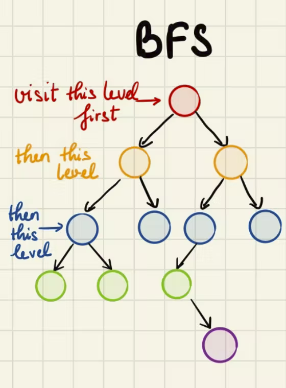

# Breadth First Search (BFS)
Logic: start at root node → go thru nodes on same level

* uses a lot of memory because
* for every level @ every node, need to store the node’s children 
* use queue data structure to store node’s children: Space: O(n)
* Downside: tree wide → queue become very large
## Code
```Python
def breadthFirstSearch(self):
    curr = self.getRoot()
    orderOfNodesList = []
    #track children for every level
    queue = []
    #add the root to queue
    queue.append(curr)
    #while there are nodes to be seen in the tree
    while queue != []:
        #take the first node
        curr = queue[0]
        #remove it from the queue
        queue = queue[1:]
        #add the node seen to the list
        orderOfNodesList.append(curr.val)
        #check if the node has children
        if curr.left:
            queue.append(curr.left)
        if curr.right:
            queue.append(curr.right)
    print("bfsList: ", orderOfNodesList)
    return orderOfNodesList
```