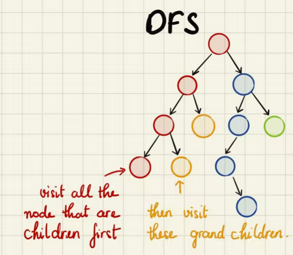

# Depth First Search (DFS)
Logic: visit all the children node first (classic example of search in tree, traverse thru left then right branch of node)



## Example: 
```
   101
33     105
```

## 3 Ways to Implement DFS:
The order title refers to which order the root node comes in
  1. Pre-order
    
    root, left, right:
    101, 33, 105
    
  2. In-order
    
    left , root, right 
    33, 101, 105
    
  3. Post-order
    
    left, right , root
    33, 105, 101
    
Space Complexity: max tree depth / height